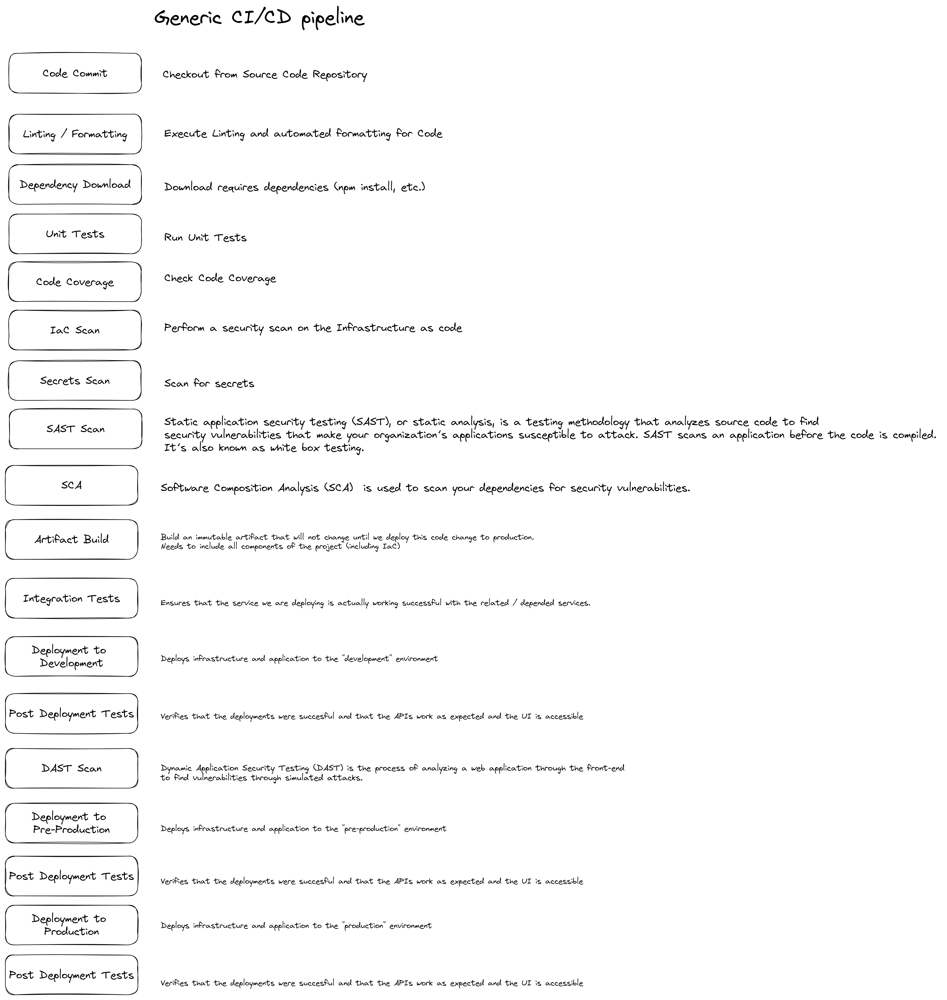

# Implementing a CI/CD pipeline in different CI/CD systems
As part of this project we are aiming to implement a simple, end to end CI/CD pipelines that contains all of the steps that follow "best practices".

With the project, we want to be able to give Builders around the globe the possibility to understand the difference between certain CI/CD tools while at the same time following best practices.
## Generic pipeline overview

A generic pipeline for a simple service or microservice looks like this:

This generic overview has three different deployment environments: development, pre-production and production.

We assume "trunk based" development which means that developers will implement changes on feature & hotfix branches and this pipeline will be executed from the "main" branch where, on the "main" branch, a deployment will automatically happen up to "production".

On "PR-creation" or also on "feature branch update", only specific steps of the pipeline should be executed (to be discussed).
The idea behind this is to give developers a quick feedback, even before merging their stuff to the "main" branch (shift-left approach for DevSecOps).

## Technology choices
### Infrastructure as Code
We are going to use [AWS CDK](https://aws.amazon.com/cdk/) for Infrastructure as Code (IaC). The code will be written in Typescript.
### Application Code
We will use [Projen](https://github.com/projen/projen) for generating the baseline code.
The backend code (lambda functions) will be written, where required, in Typescript.
The front-end code will be using Flutter - to allow cross-platform development - which means Dart.

### Pipeline Code
The code will be written in Typescript if it allows a language.
Other than that we are dependend on the requirements of the CI/CD tool.

## CI/CD Implementation
An example implementation for a CI/CD pipeline implemented in different CI/CD tools like GithubActions, CodeCatalyst Workflows, CircleCI, Jenkins, Gitlab, ...

This is what we are aiming to implement - red steps are still under discussion:

## AWS Architecture for example project
This architecture should be deployed and implemented for each environment.
As it is serverless we do not expect much costs to be created due to this.

The data shown and the UI can be defined by the one implementing this.
The lambda function painted here is just an example - it could potentially generate an S3 PreSigned URL to download the "most up to date" version of the Flutter APK.